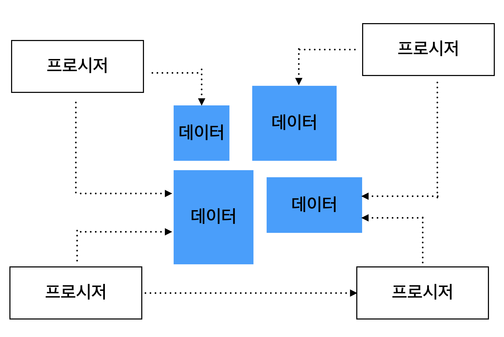
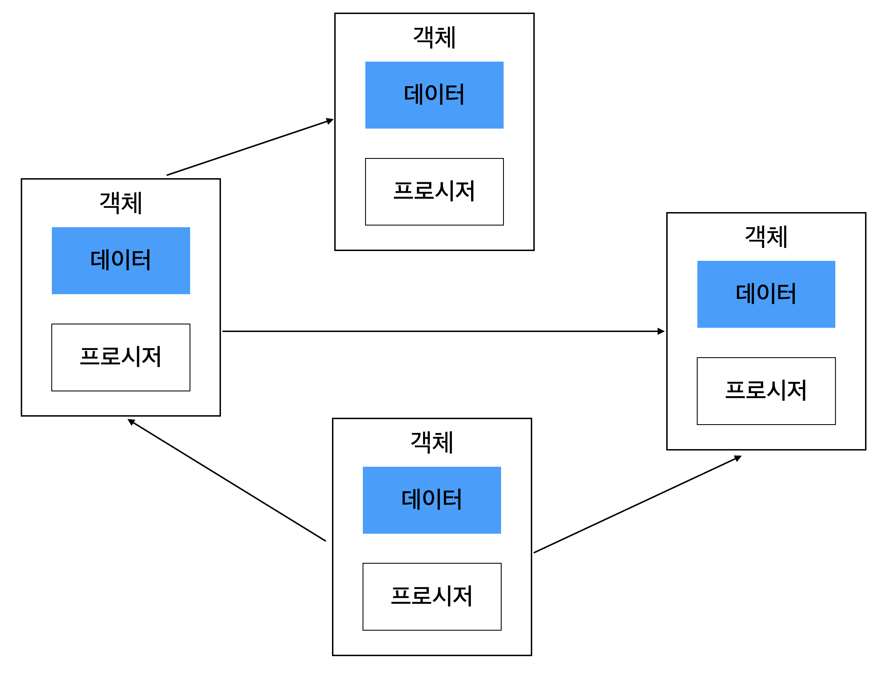

## 1. 절차 지향과 객체 지향
### 1.1 절차 지향
절차 지향 프로그래밍은 '절차적'이라는 단어 때문에 절차적으로 실행하는 것이 중점이 되는 것처럼 보인다. 그런데 절차적이지 않은 프로그래밍이란 애초에 존재하지 않는다. 또한, Procedural는 '절차'라는 의미가 아니라 `프로시저`의 의미이다. 프로시저는 루틴, 서브루틴, 메소드, 함수 등을 말한다. 즉, 절차 지향 프로그래밍은 **프로시저(procedure)로 프로그램을 구성하는 기법**을 말한다.


각 프로시저는 데이터를 사용해서 기능을 구현하고, 필요에 따라 다른 프로시저를 사용하기도 한다. 또한, 여러 프로시저가 동일한 데이터를 공유한다. 따라서 `데이터를 중심`으로 구현하게 된다.



- 장점
    - 데이터와 그 데이터를 사용하는 프로시저를 작성하는 것은 자연스러운 과정이기 때문에, 최초에 절차 지향적으로 코드를 구현하는 것은 쉽다.

- 단점
    - 요구사항이 변경되어 데이터 타입이나 의미를 변경해야 할 때, 해당 데이터를 사용하는 모든 프로시저를 함께 수정해야 한다.
    - 프로그램 규모가 커질수록 같은 데이터를 서로 다른 의미로 사용하는 경우가 생기고 따라서 얘기치 않은 오류가 발생할 수 있다.

이러한 단점은 프로그램을 구성할 때 매우 빈번하게 발생한다. 새로운 요구 사항이 생겨서 한 곳을 수정하면, 다른 곳에서 문제가 발생하고, 다시 수정하면 또 다른 곳에서 문제가 발생하는 `악순환이 발생`하기도 한다. 이는 결국 코드의 수정을 어렵게 만들고, 새로운 기능을 추가하는데 `많은 구현 시간(개발 비용)이 발생`하게 만든다.


### 1.2 객체 지향
객체들이 모여 프로그램을 구성한다. 각 객체는 자신만의 `데이터 + 데이터와 관련된 프로시저`를 갖는다.



객체는 자신만의 기능을 제공하며, 각 객체들은 서로 연결되어 다른 객체가 제공하는 기능을 사용할 수 있게 된다.

- 단점
    - 규모가 작을 때는 절차 지향 방식보다 복잡한 구조를 갖게 된다. 즉, 설계 시 더 많은 노력이 들어갈 수 있다.

- 장점
    - 객체 지향적으로 만든 코드에서는 객체의 데이터를 변경하더라도 해당 객체로만 변화가 집중되고 다른 객체에는 영향을 주지 않는다. 따라서 요구사항에 변화가 발생했을 때 쉽게 변경할 수 있는 `유연함을 제공`한다.

## 2. 객체
### 2.1 객체의 핵심은 기능을 제공하는 것
데이터와 그 데이터를 조작하는 프로시저는 객체의 물리적 특징일 뿐이다. 객체를 정의할 때 사용되는 것은 객체가 제공하는 기능이다.

### 2.2 인터페이스와 클래스
객체가 제공하는 기능을 오퍼레이션이라고 부른다. 즉, 객체가 제공하는 기능을 사용하는 것은 객체의 오퍼레이션을 사용한다는 의미이다. 
- 인터페이스 : 객체가 제공하는 오퍼레이션 집합. 기능에 대한 명세서
- 클래스 : 실제 객체의 구현을 정의하는 것

### 2.3 메시지
오퍼레이션의 실행을 요청하는 것을 `메시지를 보낸다`고 표현한다. 메서드를 호출하는 것.


## 3. 객체의 책임과 크기
객체는 객체가 제공하는 기능으로 정의된다. -> 이는 자신만의 책임이 있다는 것을 의미한다. -> 객체가 책임을 갖는다는 것은 객체가 역할을 수행한다는 의미를 갖는다.

### 어떻게 객체의 책임을 결정할까?
- 필요한 기능 목록을 정리한다. 
- 객체마다 기능을 할당한다. (가장 어려우면서 중요한 것)
    - 객체가 갖는 책임의 크기가 작다는 것은 객체가 제공하는 기능의 개수가 적다는 것을 의미한다.
    - 객체가 갖는 책임의 크기가 작아질수록 변경의 유연함을 얻을 수 있다.

## 4. 의존
한 객체가 다른 객체를 생성하거나 다른 객체의 메서드를 호출할 때, 그 객체에 의존한다고 표현한다.

### 의존의 양면성
- 내가 변경되면 나에게 의존하고 있는 코드에 영향을 준다.
- 나의 요구가 변경되면 내가 의존하고 있는 타입에 영향을 준다.

## 5. 캡슐화
캡슐화는 객체가 내부적으로 기능을 어떻게 구현하는지를 감추는 것이다. 이를 통해서 내부의 기능 구현이 변경되더라도 그 기능을 사용하는 코드는 영향을 받지 않도록 만들어준다. 즉, 내부 구현 변경의 유연함을 준다.

### 캡슐화를 위한 두 개의 규칙
- Tell, Don't Ask
    - 데이터를 물어보지 않고, 기능을 실행해 달라고 말해라.
    - 데이터를 getter로 읽는 것이 아니라, 메서드를 호출(기능 실행 요청)해라.
- 데미테르의 법칙(Law of Demeter) : Tell, Don't Ask 규칙을 따를 수 있도록 만들어주는 규칙이다.
    - 메서드에서 생성한 객체의 메서드만 호출
    - 파라미터로 받은 객체의 메서드만 호출
    - 필드로 참조하는 객체의 메서드만 호출
- 데미테르의 법칙을 지키지 않는 전형적인 증상
    - 연속된 get 메서드 호출
    - 임시 변수의 get 호출이 많음

```java
// 데미테르 법칙 위반
member.getDate().getTime();
```

위의 코드는 데미테르 법칙을 위반했다. member의 getDate() 메서드를 호출한 뒤에, getDate()가 리턴한 Date 객체의 getTime() 메서드를 호출했기 때문이다.
데미테르의 법칙을 따르려면, member 객체에 한 번의 기능 실행을 요청하도록 변경해야 한다.

```java
member.isExpired();
```

## 객체 지향 설계 과정
1. 필요한 기능 목록을 정리한다.
2. 기능을 알맞은 객체에 할당한다.
    - 기능을 구현하는데 필요한 데이터를 객체에 추가한다. 데이터를 먼저 추가하고, 데이터를 이용하는 기능을 넣는다.
    - 기능은 최대한 캡슐화해서 구현한다.
3. 객체 간에 어떻게 메시지를 주고받을 지 결정한다.
4. 개발하는 동안 위의 과정을 지속적으로 반복한다.