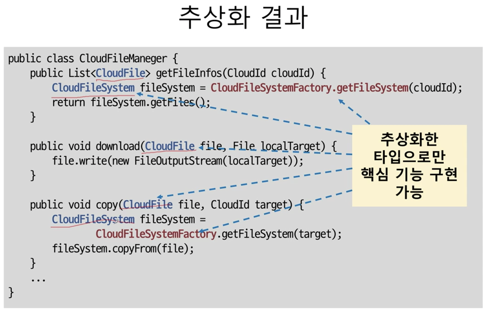

# 다형성과 추상 타입
추상화는 객체 지향에서 구현 변경의 유연함을 주는 방법 중 하나이다. 추상화는 다형성으로 가능해진다.

다형성(Polymorphism)은 한 객체가 여러 가지(poly) 모습(morph)을 갖는다는 것을 의미한다. 여기서 모습은 `타입`을 뜻하는데, 즉, 다형성이란 `한 객체가 여러 타입을 가질 수 있다`는 것을 뜻한다.

### 인터페이스 상속과 구현 상속
인터페이스 상속은 순전히 `타입 정의만을 상속`받는 것이다.

구현 상속은 클래스 상속을 통해서 이루어진다. 구현 상속은 보통 상위 클래스에 정의된 기능을 `재사용`하기 위한 목적으로 사용된다.

## 추상 타입과 유연함
추상화(abstraction)는 데이터나 프로세스 등을 의미가 비슷한 개념이나 표현으로 정의하는 과정이다. 추상화의 목적은 동작과 클래스 구현 세부 사항을 분리하는 것을 목표로 한다.
- FTP에서 파일을 다운로드
- 소켓에서 데이터 읽기
- DB 테이블의 데이터를 조회
세 가지 기능 모두 로그를 수집하기 위한 기능이다. 따라서 '로그 수집'이라는 개념으로 추상화할 수 있다.
이 추상 타입은 로그 정보를 수집한다는 의미를 제공하지만, FTP에서 파일을 다운로드할지, 소켓에서 데이터를 읽어 올지에 대한 상세 구현은 알 수 없다.

### 추상 타입과 실제 구현의 연결
추상 타입과 실제 구현 클래스는 상속을 통해서 연결한다. 즉, 구현 클래스가 추상 타입을 상속받는 방법으로 둘을 연결한다. 각 하위 타입들은 추상 타입에 정의된 기능을 실제 구현하는데, 이렇게 실제 구현을 제공하는 클래스들을 '콘크리트 클래스(contrete class)' 라고 부른다.
> 추상 클래스가 아닌 클래스는 모두 콘크리트 클래스라고 할 수 있다.


### 추상 타입을 이용한 구현 교체의 유연함
**콘크리트 클래스를 직접 사용해요 문제가 없는데, 왜 추상 타입을 사용하는 것일까?**

추상화 하지 않은 코드와 추상화 한 코드를 비교해보고 왜 추상 타입을 사용하는지 보자.

- 클라우드 파일 통합 관리 기능 개발
- 대상 클라우드
    - 드롭박스, 박스
- 주요 기능
    - 각 클라우드의 파일 목록 조회, 다운로드, 업로드, 삭제, 검색

```java
public enum CloudId {
    DROPBOX,
    BOX;
}

public class FileInfo {
    private CloudId cloudId;
    private String fildId;
    private String name;
    private long length;
}
```

### 추상화 하지 않은 코드
CloudFileManager class

1. 파일 목록 조회

```java
public List<FileInfo> getFileInfos(CloudId cloudId) {
    if (cloudId == CloudId.DROPBOX) {
        // ...
    } else if (cloudId == CloudId.BOX) {
        // ...
    }
}
```

2. 파일 다운로드

```java
public void download(FileInfo file, File localTarget) {
    if (file.getCloudId() == CloudId.DROPBOX) {
        DropboxClient dc = ...;
        // ...
    } else if (file.getCloudId() == CloudId.BOX) {
        BoxService boxSvc = ...;
        // ...
    }
}
```

위의 코드 처럼 CloudId에 따라서 기능을 구현하는 방법이 다르기 때문에 DROPBOX, BOX 각각의 구현 코드를 나누어 작성할 것이다. 마찬가지로 업로드, 삭제, 검색 기능에 대한 구현 또한 if, else문을 사용해서 각각의 기능을 구현할 것이다.

### 추상화 하지 않은 코드의 문제점은 무엇일까?
클라우드 추가가 발생했다고 생각해보자. 아래의 코드처럼 추가된 클라우드의 수 만큼 else if 문으로 나눠서 각 클라우드를 처리하는 추가적인 구현 코드를 작성해야 한다.

```java
public List<FileInfo> getFileInfos(CloudId cloudId) {
    if (cloudId == CloudId.DROPBOX) {
        // ...
    } else if (cloudId == CloudId.BOX) {
        // ...
    } else if (cloudId == CloudId.SCLOUD) {

    } else if (cloudId == CloudId.NCLOUD) {
        
    } else if (cloudId == CloudId.DCLOUD) {
        
    }
}
```

위의 상황이 반복된다면, 
- 코드 구조가 길어지고 복잡해진다. 새로운 클라우드 추가시 모든 메서드에 if-else 블럭을 추가하고 기능을 구현해야 한다. 즉, if-else는 덕지덕지 붙을 것이고 개발자는 코드가 어디서 어떻게 실행되는지 알아야 하기 때문에 각각의 if-else 문을 확인해야 한다.
- 관련 코드가 여러 곳에 분산되어 있게 되고, 분석 속도와 가독성이 떨어지게 된다. 위의 코드에서 BOX 클라우드에 대한 처리를 하려면 모든 메서드의 if 문에서 BOX 코드 위치를 찾아야 한다.
- 실수하기 쉽고, 디버깅 하는 시간이 오래 걸린다.

시간이 흘러갈 수록, 기능이 추가될 수록 위의 문제점을 더욱 커질 것이다. 결국에는 코드 한 줄을 만드는 개발 시간이 증가하게 될 것이고 비용이 점점 증가하게 될 것이다.


### 추상화 코드로 변경
DROPBOX, BOX, SCLOUD, DCLOUD, NCLOUD => 클라우드 파일 시스템 으로 추상화할 수 있다.


DROPBOX 용 구현

```java
public class DropBoxFileSystem implements CloudFileSystem {
    private DropBoxClient dbClient = new DropBoxClient(...);

    @Override
    public List<CloudFile> getFiles() {
        List<DbFile> dbFiles = dbClient.getFiles();
        List<CloudFiles> results = new ArrayList<>(dbFiles.size());
        // ...
        return results;
    }
}
```

```java
public class DropBoxCloudFile implements CloudFile {
    private DropBoxClient dbClient;
    private DbFile dbFile;

    // ...
}
```

파일 목록, 다운로드 기능 구현

```java
public List<CloudFile> getFileInfos(CloudId cloudId) {
    CloudFileSystem fileSystem = CloudFileSystemFactory.getFileSystem(cloudId);
    return fileSystem.getFiles();
}

public void download(CloudFile file, File localTarget) {
    file.write(new FileOutputStream(localTarget));
}
```

BOX 클라우드 지원을 추가하려면 어떻게 해야할까? 


추상화한 CloudFileSystem, CloudFile 두 타입을 구현한 BOX 콘크리트 클래스만 구현하면 된다. 그리고 CloudFileSystemFactory에서 CloudId에 따라 알맞게 BoxFileSystem 을 리턴하면 된다.

BOX 클라우드의 파일 목록, 다운로드 기능 구현

```java
public List<CloudFile> getFileInfos(CloudId cloudId) {
    CloudFileSystem fileSystem = CloudFileSystemFactory.getFileSystem(cloudId);
    return fileSystem.getFiles();
}

public void download(CloudFile file, File localTarget) {
    file.write(new FileOutputStream(localTarget));
}
```

### 추상화로 얻을 수 있는 이점
DROPBOX 의 파일 목록, 다운로드 기능을 구현했을 때와 코드가 동일한 것을 알 수 있다. 추상 타입을 사용했기 때문에 코드의 변경없이 사용할 수 있다.




CloudFileManager를 수정하는 것 없이 새로운 클라우드를 추가할 수 있다. 이처럼 추상화를 사용하면 나(CloudFileManager)를 바꾸지 않고, 내가 사용하는 대상(CloudFileSystem)을 바꿀 수 있는 유연함을 얻을 수 있다.

또한 특정 클라우드에 관한 코드가 한 곳에 모이기 때문에 특정 클라우드의 코드를 확인하거나 변경이 필요할 때 빠르게 찾아 수정할 수 있게 된다. 

이러한 특징은 `OCP(Open-Closed Principle)` 를 말한다. 
- 기능을 변경하거나 확장할 수 있으면서, 그 기능을 사용하는 코드는 수정하기 않아야 한다.
- 즉, 확장에는 열려 있고, 수정엔 닫혀있어야 한다.

결론적으로 추상화를 잘하면, OCP를 따르는 구조를 가질 가능성을 높일 수 있다. 그리고 변경이나 확장하는 비용을 낮출 수 있다.

### 어떻게 추상화를 잘 할 수 있나?
1. 변화되는 부분 추상화 하기
요구 사항이 바뀔 때 변화되는 부분은 이후에도 변경될 소지가 많다. 이런 부분을 추상 타입으로 교체하면 향후 변경에 유연하게 대처할 수 있는 가능성이 높아진다.

2. 변화되는 시점에 추상화 하기
하지만 무분별한 추상화는 전체 추상 타입 증가와 이로 인한 코드 복잡도 증가를 일으킨다. 따라서 아직 존재하지 않는 기능에 대한 이른 추상화는 주의해야 한다. 실제로 변경이나 확장이 발생할 때 추상화를 시도하는 것이 좋다.

3. 인터페이스는 인터페이스 사용자 입장에서 만들기
추상화한 인터페이스의 의미를 명확하게 드러낼 수 있도록 이름을 명명해야 한다.


## 참고
- [인프런 - 객체 지향 프로그래밍 입문](https://www.inflearn.com/course/%EA%B0%9D%EC%B2%B4-%EC%A7%80%ED%96%A5-%ED%94%84%EB%A1%9C%EA%B7%B8%EB%9E%98%EB%B0%8D-%EC%9E%85%EB%AC%B8/lecture/13433?tab=curriculum&volume=1.00&speed=1.5)